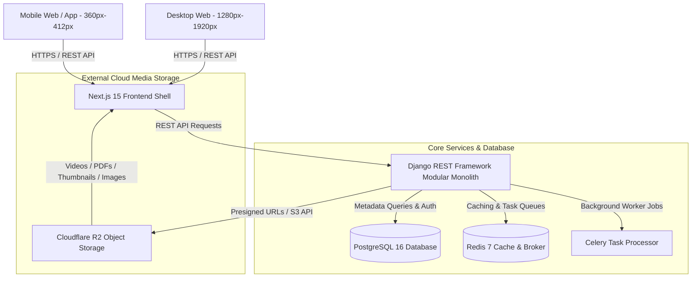

# ANKIT JEE — System Architecture & Design Document

## 1. Executive System Overview

ANKIT JEE is a production-grade, highly responsive EdTech platform tailored for **JEE Main** and **JEE Advanced** aspirants. It adopts a **Modular Monolith** architecture designed to scale seamlessly while keeping deployment and maintenance overhead minimal.

---

## 2. Component Responsibilities

### Frontend (Next.js 15 + TypeScript + Tailwind CSS)
* **Framework**: Next.js App Router with React 19.
* **Layout Paradigm**:
  * **Desktop**: Fixed dark navigation sidebar (`lg:w-64`), multi-column dashboard grid, detailed statistical metrics, high information density.
  * **Mobile**: Compact header with bottom navigation bar (Home, Learn, Tests, Progress, Profile) optimized for touch targets on 360px–412px viewports.
* **Data Fetching**: Typed API Client abstraction (`@/lib/api-client.ts`) utilizing `axios` targeting `NEXT_PUBLIC_API_URL`.

### Backend (Django 4.2 + Django REST Framework)
* **Architecture**: Modular Monolith separated into domains under `apps/`:
  * `accounts`: Custom `User` model with roles (`STUDENT`, `ADMIN`, `INSTRUCTOR`) and `StudentProfile`.
  * `academics`: `Exam`, `Subject`, `Category`, `Chapter`, `Topic`.
  * `content`: Video metadata supporting dual sources (`YOUTUBE` and `CLOUD`).
  * `questions`: `Question`, `QuestionOption`, `PYQ` (Previous Year Questions).
  * `tests`: `Test`, `TestQuestion`, `TestAttempt`.
  * `progress`: `VideoProgress`, `QuestionAttempt`, `Bookmark`, `StudentProgress`.
  * `materials`: PDF Study Materials, Formula Sheets, Notes metadata.
  * `analytics`: Performance aggregations & percentile statistics.
  * `core`: Shared abstract models (`TimeStampedModel`), views (Health Check), and OpenAPI schemas.
* **API Documentation**: Automated OpenAPI 3.0 / Swagger UI generated using `drf-spectacular` at `/api/docs/`.

### Database (PostgreSQL 16)
* Primary relational storage for metadata, structured content definitions, student accounts, test attempt records, and progress metrics.
* **Important Constraint**: PostgreSQL **only** stores metadata references (`r2_object_key`, `youtube_video_id`, `thumbnail_key`). Binary media files are never stored inside PostgreSQL.

### Cache & Task Queue (Redis 7 + Celery 5)
* **Redis**: Used as Django session cache, API response caching, and Celery message broker.
* **Celery**: Handles asynchronous background tasks (test score calculations, video processing notifications, email/SMS notifications).

### File & Video Storage (Cloudflare R2)
* S3-compatible object storage hosted on Cloudflare R2.
* Stores heavy binary media assets under structured prefixes:
  * `/videos/`: High-definition lecture videos.
  * `/thumbnails/`: Video cover images.
  * `/materials/`: PDF formula sheets and revision handouts.
  * `/images/`: Question diagrams and solution illustrations.
* **Security & Access Control**: Cloudflare R2 credentials (`R2_SECRET_ACCESS_KEY`) are kept exclusively on the Django backend. Django generates temporary, secure presigned URLs for client playback/downloads.

---

## 3. Video Architecture (YouTube vs Cloud R2)

The system supports a dual-source video delivery architecture via `video_source_type`:

| Source Type | Storage Location | Delivery Mechanism | Access Control |
| :--- | :--- | :--- | :--- |
| `YOUTUBE` | YouTube Platform | Embedded YouTube Player (`youtube_video_id`) | Public / Unlisted YouTube URL |
| `CLOUD` | Cloudflare R2 Bucket | HTML5 Custom Player / HLS Streaming | Presigned Signed URLs generated by Django backend |

---

## 4. Environment & Containerization Strategy

Docker Compose orchestrates the development ecosystem:
* `frontend`: Next.js production build / dev server container (Port 3000).
* `backend`: Django WSGI/Gunicorn container (Port 8000).
* `postgres`: Isolated PostgreSQL database container (Port 5432).
* `redis`: Isolated Redis cache container (Port 6379).
* `celery_worker`: Background job worker process container.

Communication between containers relies strictly on Docker internal service names (`postgres`, `redis`, `backend`, `frontend`) without hardcoded localhost references.
